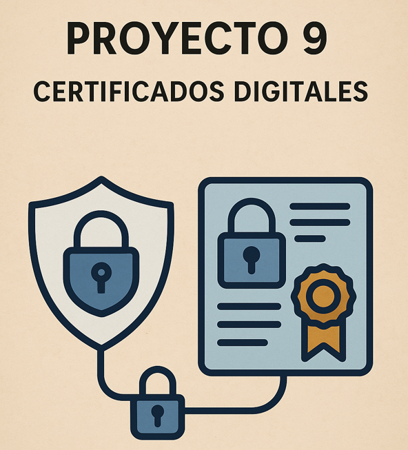
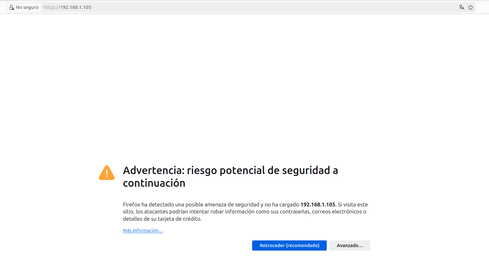
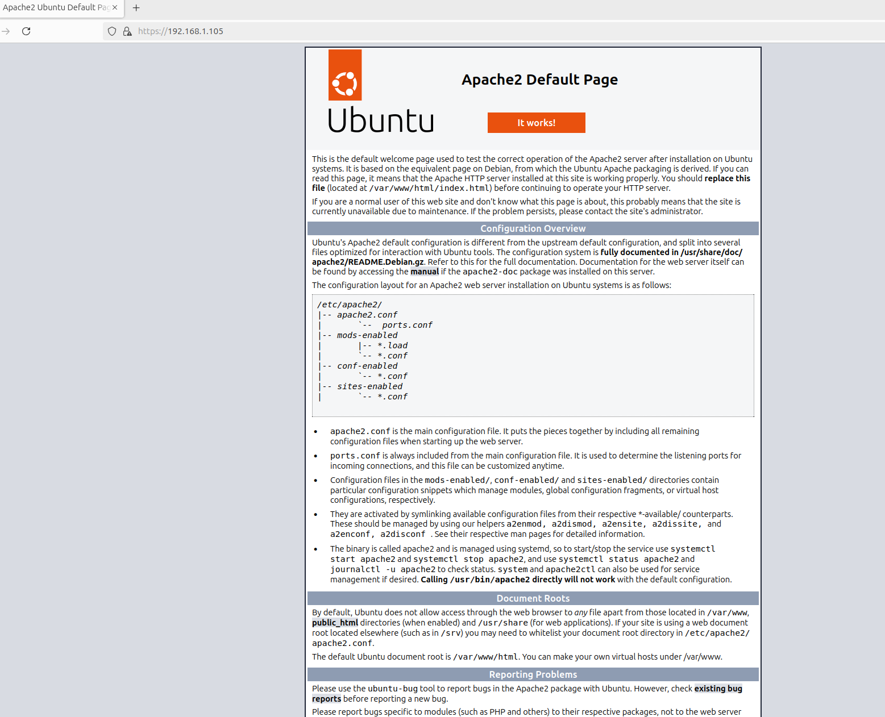
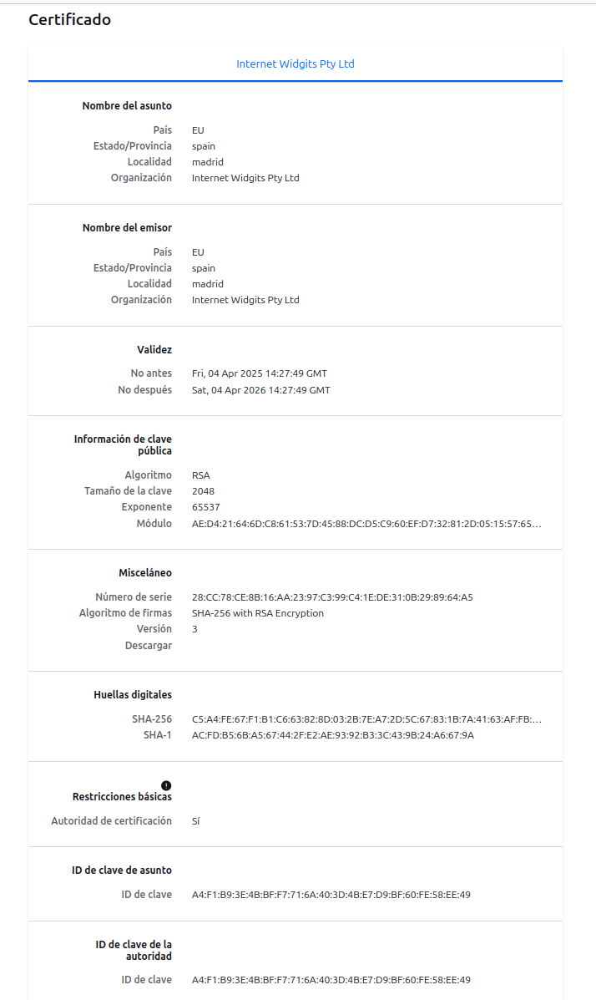
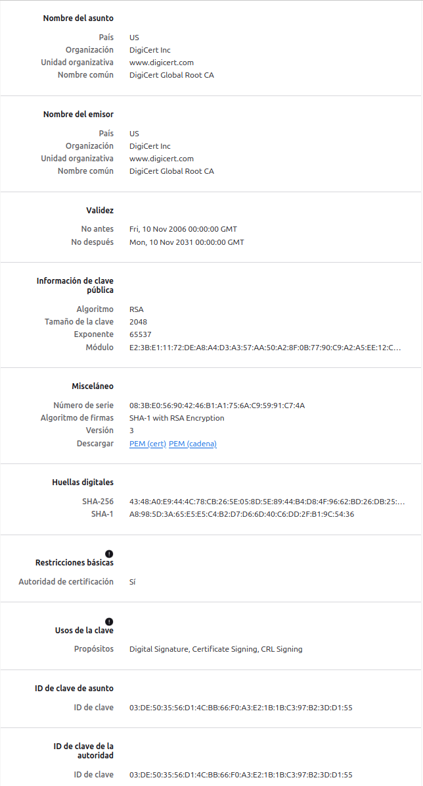

[**1\. Introducción**](#1.-introducción)

[**2\. Certificado autofirmado \- Capturas y datos**](#2.-certificado-autofirmado---capturas-y-datos)

[**3\. Certificado verificado \- Wikipedia**](#3.-certificado-verificado---wikipedia)

[**4\. Comparativa entre certificados**](#4.-comparativa-entre-certificados)

[**5\. Conclusión**](#5.-conclusión)

**Proyecto 9 \- Parte 2: Certificados Digitales (Vía Simulada)**

### **1\. Introducción**

En esta segunda parte del proyecto he configurado un servidor web en una máquina virtual Ubuntu Server con Apache2. He generado un certificado digital autofirmado para habilitar el protocolo HTTPS, lo que permite establecer conexiones cifradas entre cliente y servidor.

Mi objetivo simplemente fue comprobar el funcionamiento de este certificado, observar cómo lo interpreta el navegador web, y compararlo con el certificado de un sitio web verificado en mi caso como ejemplo usé Wikipedia

---

### **2\. Certificado autofirmado \- Capturas y datos** 

Una vez instalado el servidor de apache2 y se habilitaron los servicios para acceder al servidor desde el navegador en Ubuntu Desktopingrese al servidor mediante la URL **`https://192.168.1.105`** al tratarse de un certificado autofirmado, el navegador mostró inicialmente una advertencia de seguridad.

Tras aceptar el riesgo y continuar, se pudo acceder a la página web del servidor con HTTPS activo.

 Al inspeccionar el certificado, se obtuvieron los siguientes datos:

* **Nombre del asunto / emisor:** Internet Widgits Pty Ltd

* **Localidad:** Madrid

* **País:** EU

* **Vigencia:** 4 abril 2025 \- 4 abril 2026

* **Algoritmo de clave pública:** RSA 2048 bits

* **Firma:** SHA-256 con RSA Encryption

* **Cadena de confianza:** No verificada (autofirmado)

---

### **3\. Certificado verificado \- Wikipedia** 

Se accedió al sitio https://www.wikipedia.org y se inspeccionaron los datos del certificado válido.

* **Nombre del asunto:** Wikimedia Foundation, Inc.

* **Emisor:** Let's Encrypt Authority X3

* **Vigencia:** Válida, renovada periódicamente (aproximadamente cada 90 días)

* **Algoritmo de clave pública:** RSA 2048 bits

* **Firma:** SHA-256 con RSA Encryption

* **Cadena de confianza:** Válida y verificada por CA reconocida

---

### **4\. Comparativa entre certificados**

| Característica | Certificado Autofirmado | Certificado Verificado (Wikipedia) |
| ----- | ----- | ----- |
| Emisor | El propio servidor (Internet Widgits Pty Ltd) | Let's Encrypt (CA reconocida) |
| Validez | 1 año (365 días) | \~90 días (renovable) |
| Confianza del navegador |  No confiable, requiere excepción manual |  Totalmente confiable |
| Cadena de certificación | No existente | Completa (intermedia \+ raíz) |
| Costo | Gratuito | Gratuito (Let's Encrypt) |
| Uso recomendado | Desarrollo, pruebas locales | Producción, sitios públicos |

---

### **5\. Conclusión**

El certificado autofirmado permite establecer comunicaciones cifradas, pero no garantiza la autenticidad del servidor, ya que no ha sido firmado por una autoridad certificadora confiable. Por ello, los navegadores muestran advertencias de seguridad.

En entornos reales, es imprescindible utilizar certificados válidos emitidos por entidades reconocidas como Let 's Encrypt, ya que garantizan la identidad del sitio web, evitan alertas en el navegador y mejoran la seguridad y confianza del usuario final.
