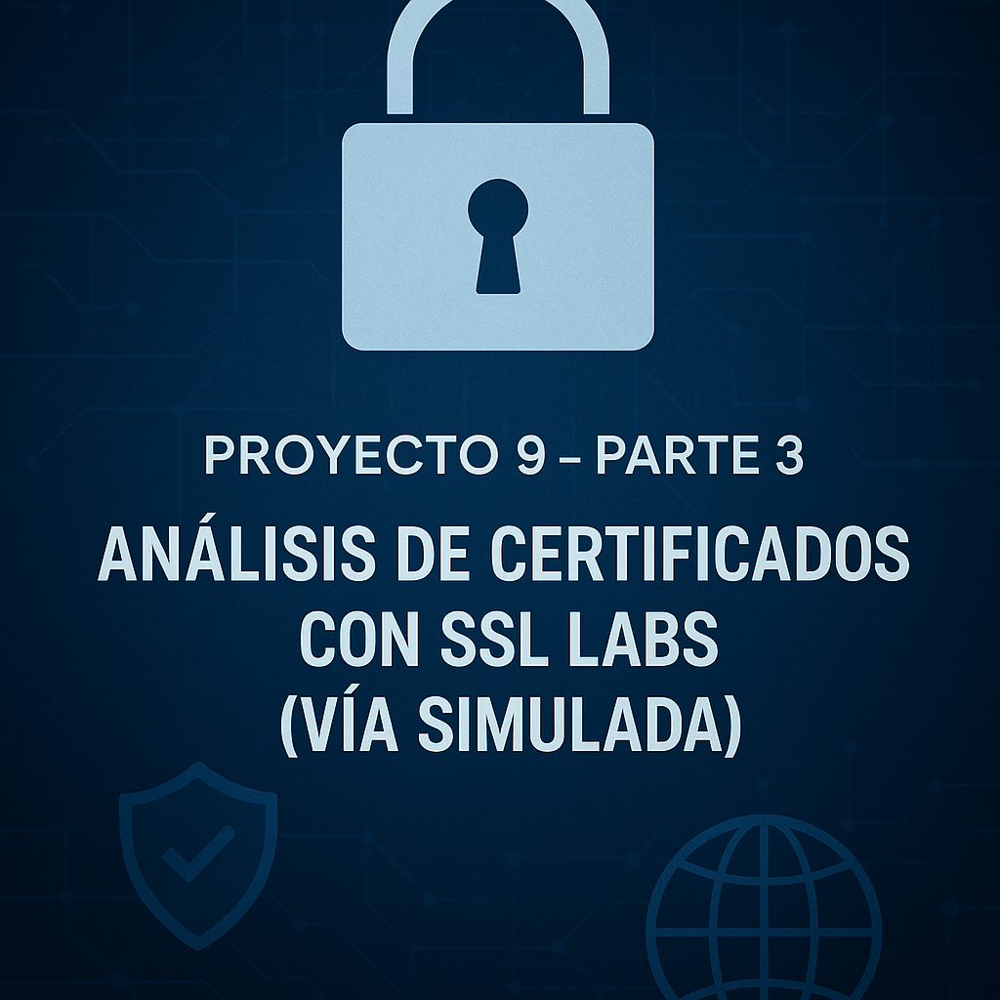
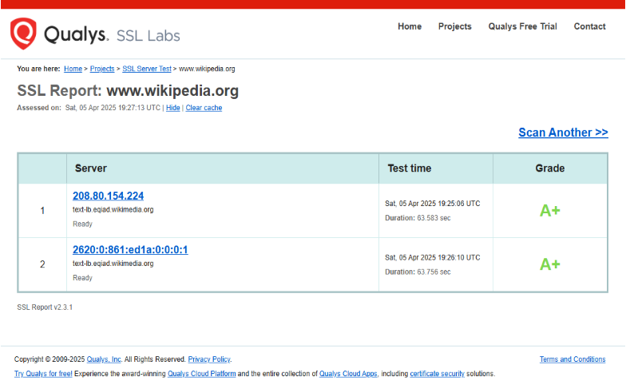
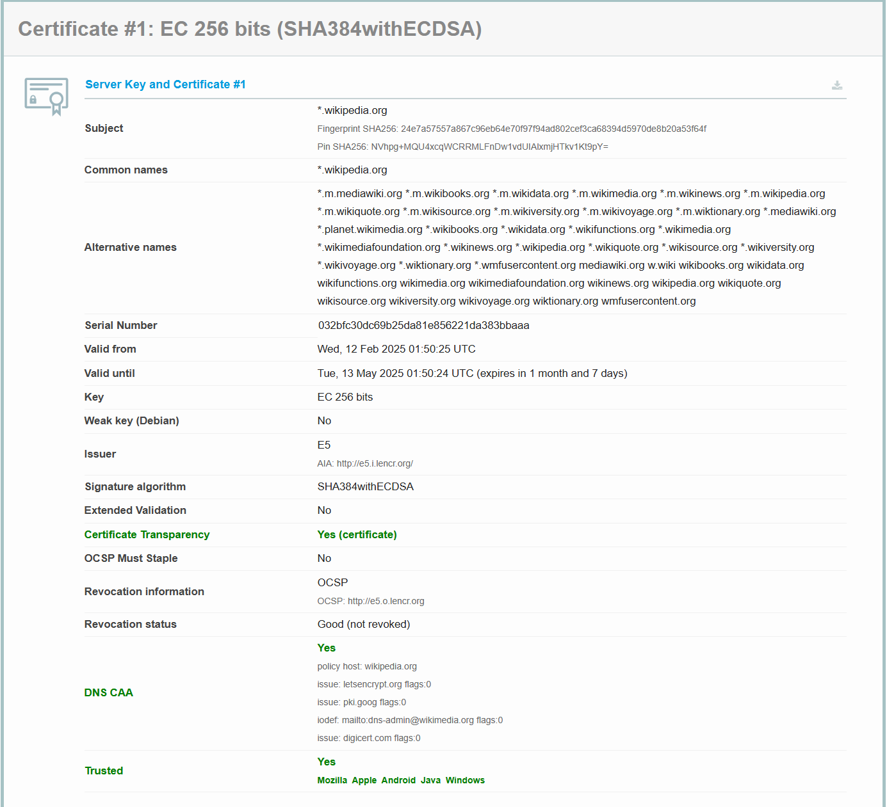

[**Proyecto 9 \- Parte 3: Análisis de Certificados con SSL Labs (Vía Simulada)	1**](#proyecto-9---parte-3:-análisis-de-certificados-con-ssl-labs-\(vía-simulada\))

[**Introducción	5**](#introducción)

[1\. Análisis de Certificado Válido (Ejemplo: Wikipedia)	5](#1.-análisis-de-certificado-válido-\(ejemplo:-wikipedia\))

[2\. Análisis de Certificados Inválidos	8](#2.-análisis-de-certificados-inválidos)

[Ejemplo 1: Certificado Expirado	8](#ejemplo-1:-certificado-expirado)

[Ejemplo 2: Nombre de Host Incorrecto (Mismatch)	9](#ejemplo-2:-nombre-de-host-incorrecto-\(mismatch\))

[Ejemplo 3: Certificado Autofirmado / Emisor No Confiable	10](#ejemplo-3:-certificado-autofirmado-/-emisor-no-confiable)

[Conclusión	12](#conclusión)

# Introducción 

En esta tercera parte del proyecto, se utiliza el servicio en línea SSL Labs de Qualys para realizar un análisis detallado de la configuración TLS/SSL. Siguiendo la **Vía Simulada**, donde en la Parte 2 se generó un certificado autofirmado para un servidor local (`https://192.168.1.105`), se entiende que dicho certificado no es públicamente válido ni confiable por defecto.

Para cumplir con los requisitos de analizar un certificado **válido** según los estándares públicos, se examinará la configuración de **`https://www.wikipedia.org`** (sitio ya referenciado en la Parte 2\) utilizando SSL Labs. Este análisis servirá para ilustrar las características que hacen que un certificado sea confiable en un entorno real.

Posteriormente, se analizarán tres certificados deliberadamente **erróneos** de diferente tipo, utilizando los sitios de prueba `badssl.com`, para comprender las causas comunes de invalidez.

## 1\. Análisis de Certificado Válido (Ejemplo: Wikipedia) {#1.-análisis-de-certificado-válido-(ejemplo:-wikipedia)}

**Sitio Web Analizado:** `https://www.wikipedia.org`

Como se estableció en la Parte 2, el certificado autofirmado generado para `192.168.1.105` no posee una cadena de confianza verificable por una CA pública, lo que provoca advertencias en los navegadores. Para observar cómo SSL Labs evalúa una configuración considerada válida y confiable, se analiza `www.wikipedia.org`.

Se utilizó el servicio [SSL Server Test de Qualys SSL Labs](https://www.ssllabs.com/ssltest/) para este análisis.  
**Resultados del Análisis (SSL Labs para [www.wikipedia.org](http://www.wikipedia.org)):**

**Explicación de la Validez (Basada en resultados de SSL Labs):**

El certificado de `www.wikipedia.org` es verificado como válido por SSL Labs y los navegadores debido a los siguientes factores clave:

1. **Cadena de Confianza Completa y Confiable:**  
     
   * El certificado del servidor (\*.wikipedia.org) fue emitido por la CA intermedia E5.  
   * Esta CA intermedia (E5) a su vez fue emitida por la CA Raíz ISRG Root X1 (la raíz principal de Let's Encrypt).  
   * SSL Labs confirma que la cadena no presenta problemas (Chain issues: None) y que el certificado final es confiable (Trusted: Yes) según los almacenes de confianza de los principales sistemas (Mozilla, Apple, Android, Java, Windows).

   

2. **Coincidencia de Nombre (Subject Alternative Names \- SANs):**  
     
   * El certificado incluye \*.wikipedia.org como nombre común y una lista extensa de nombres alternativos (SANs).  
   * Esta lista contiene explícitamente wikipedia.org, www.wikipedia.org (cubierto por el wildcard \*.wikipedia.org), y muchos otros dominios y subdominios relacionados con Wikimedia (\*.m.wikipedia.org, wikimedia.org, mediawiki.org, etc.).  
   * Esto asegura que el certificado es válido para el dominio específico al que se accede (www.wikipedia.org) y muchos otros sitios operados por la fundación.

   

3. **Periodo de Validez Vigente:**  
     
   * El certificado es válido desde Wed, 12 Feb 2025 01:50:25 UTC.  
   * El certificado expira el Tue, 13 May 2025 01:50:24 UTC.  
   * La fecha del análisis (Mon, 07 Apr 2025 04:36:31 UTC) cae dentro de este periodo, confirmando que el certificado está activo y no ha caducado.

   

4. **Estado de Revocación Válido:**  
     
   * El certificado incluye información para la verificación de revocación mediante OCSP (OCSP: http://e5.o.lencr.org).  
   * SSL Labs realizó la comprobación y el estado de revocación es Good (not revoked), lo que significa que la CA emisora (E5) no ha invalidado este certificado antes de su fecha de expiración.  
   * Además, el servidor soporta OCSP stapling: Yes, lo que mejora la eficiencia de la comprobación de revocación.

   

5. **Algoritmos Criptográficos Seguros:**  
     
   * La clave pública del servidor utiliza Criptografía de Curva Elíptica (Key: EC 256 bits), considerada moderna y eficiente.  
   * El algoritmo de firma del certificado del servidor es SHA384withECDSA, utilizando un hash fuerte (SHA-384) y una firma basada en curva elíptica.  
   * El servidor soporta los protocolos seguros más recientes: TLS 1.3 y TLS 1.2, y ha deshabilitado los protocolos obsoletos e inseguros (TLS 1.1, 1.0, SSLv3, SSLv2).  
   * Utiliza conjuntos de cifrado (Cipher Suites) modernos y seguros, como TLS\_AES\_128\_GCM\_SHA256, TLS\_CHACHA20\_POLY1305\_SHA256 para TLS 1.3 y suites ECDHE\_ECDSA con AES-GCM o ChaCha20 para TLS 1.2, todos ellos proporcionando Forward Secrecy (FS).

   

6. **Calificación General del Servidor (Inferida):**  
     
   * Aunque la letra de calificación final (A/A+) no está en el extracto proporcionado, todos los detalles técnicos apuntan a una configuración excelente: cadena de confianza válida, algoritmos fuertes, protocolos modernos habilitados y antiguos deshabilitados, soporte para Forward Secrecy (ROBUST), HSTS activado (Yes con preload), mitigación contra vulnerabilidades conocidas (BEAST, POODLE, Heartbleed, ROBOT, etc., indicadas como No o Mitigated). Esto configura una infraestructura TLS/SSL muy segura y robusta.

## 2\. Análisis de Certificados Inválidos 

He  analizado tres sitios web de badssl.com con diferentes tipos de errores en sus certificados TLS/SSL utilizando SSL Labs. Se relacionarán cada error detectado por SSL Labs con los mensajes de error típicos que un navegador mostraría.

### Ejemplo 1: Certificado Expirado {#ejemplo-1:-certificado-expirado}

**Sitio Web Analizado:** https://expired.badssl.com/

Este sitio presenta intencionadamente un certificado cuya fecha de validez ha pasado.

**Resultados del Análisis (SSL Labs):**

![][image3]  
**Explicación de la Invalidez:**

SSL Labs detecta que la fecha actual es posterior a la fecha "Valid until" (No después) del certificado y lo marca explícitamente como **"Certificate expired"**. Un certificado expirado no ofrece garantías sobre la identidad del sitio ni la seguridad de la clave privada asociada, por lo que es rechazado.

**Relación con Errores de Navegador (Según Artículo):** Este tipo de problema corresponde directamente al error **Net::ERR\_CERT\_DATE\_INVALID**. Como explica el artículo, este error surge cuando hay un problema con la fecha y hora, ya sea del servidor o, más comúnmente, del equipo del usuario que impide validar correctamente el periodo de vigencia del certificado. Aunque SSL Labs verifica desde un servidor con hora correcta, el *motivo* del rechazo es el mismo: el certificado está fuera de su periodo de validez.

### Ejemplo 2: Nombre de Host Incorrecto (Mismatch)

**Sitio Web Analizado:** https://alberche-dream.com/  
Este sitio sirve un certificado que es técnicamente válido (emitido por CA confiable, no expirado) pero *no* para el nombre de dominio https://alberche-dream.com/al que se está accediendo.

**Resultados del Análisis (SSL Labs):**  
![][image4]

**Explicación de la Invalidez:**

El análisis revela que el certificado presentado por el servidor tiene como Common Name (CN) y único Subject Alternative Name (SAN) el dominio: cluster029.hosting.ovh.net

Sin embargo, el dominio al que el usuario intenta acceder es: alberche-dream.com

Esto provoca un error crítico de **"certificate name mismatch"** (nombre de certificado no coincidente) porque el nombre del dominio visitado (alberche-dream.com) no está incluido en la lista de nombres para los que el certificado es válido (cluster029.hosting.ovh.net). Como resultado, el navegador no puede verificar que el certificado pertenece legítimamente al sitio alberche-dream.com.

La causa técnica más probable es una configuración incorrecta en el servidor de alojamiento (OVH, en este caso), donde se está sirviendo el certificado genérico del clúster de hosting en lugar de un certificado SSL emitido y configurado específicamente para el dominio alberche-dream.com.

**Relación con Errores de Navegador (Según Artículo y Descripción):** Esta discrepancia de nombres se manifiesta en los navegadores típicamente como el error **ERR\_CERT\_COMMON\_NAME\_INVALID**. Como se indicó en el artículo de referencia, este error surge cuando la información (específicamente, los nombres de dominio) del certificado no concuerda con el dominio al que se está accediendo, impidiendo la validación segura de la identidad del sitio.

El texto proporcionado para este caso también menciona que, dependiendo del navegador y sus políticas específicas, esta situación podría *potencialmente* derivar en un error como ERR\_SSL\_VERSION\_OR\_CIPHER\_MISMATCH, aunque la causa raíz fundamental sigue siendo la no coincidencia del nombre del host. En cualquier caso, el acceso seguro es bloqueado.

### Ejemplo 3: Certificado Autofirmado / Emisor No Confiable {#ejemplo-3:-certificado-autofirmado-/-emisor-no-confiable}

**Sitio Web Analizado:** https://self-signed.badssl.com/

Este sitio utiliza intencionadamente un certificado firmado por sí mismo, lo cual es análogo al certificado generado en la Parte 2 de este proyecto (vía simulada) y sirve para demostrar problemas de confianza.

**Resultados del Análisis (SSL Labs):**  
![][image5]

**Explicación de la Invalidez:**

El informe de SSL Labs identifica claramente el problema principal: el certificado **no es confiable** (Trusted: No NOT TRUSTED). La razón fundamental es que el **emisor (Issuer)** del certificado es la misma entidad que el sujeto (\*.badssl.com), indicando que es **"Self-signed"** (autofirmado).

Al ser autofirmado:

1. No existe una cadena de certificados (Chain issues: None, pero esto se refiere a la cadena *proporcionada*, que es solo el certificado autofirmado en sí mismo) que pueda validarse hasta una Autoridad de Certificación (CA) Raíz reconocida públicamente.  
2. La entidad emisora (\*.badssl.com) no se encuentra en los almacenes de confianza de los navegadores y sistemas operativos (Mozilla, Apple, Android, Java, Windows).

SSL Labs asigna una calificación general de **"T"** (por Trust issue) debido a esta falta de confianza fundamental. Adicionalmente, el informe nota otras debilidades como el soporte para protocolos obsoletos (TLS 1.1, TLS 1.0), lo que limita la calificación potencial (si se ignorase el problema de confianza) a "B", y la presencia de múltiples suites de cifrado marcadas como WEAK. Sin embargo, la razón primordial del rechazo por parte de los navegadores es la **falta de confianza en el emisor**.

**Relación con Errores de Navegador (Según Artículo y Descripción):** Este escenario de un certificado autofirmado o emitido por una CA desconocida genera típicamente el error **NET::ERR\_CERT\_AUTHORITY\_INVALID** en los navegadores. Como describe el artículo, este error aparece porque la "Autoridad" que emitió el certificado no es válida o no es reconocida por el almacén de confianza del navegador. En el caso de un certificado autofirmado, la autoridad es el propio sitio, que por definición no es una CA pública confiable. Esto impide verificar la autenticidad del sitio de manera estándar.

## Conclusión

La tercera parte del proyecto me ha permitido aplicar de forma práctica los conceptos teóricos sobre certificados digitales utilizando la herramienta de análisis SSL Labs. Mediante el examen detallado de un sitio web con una configuración válida y reconocida como por ejemplo (www.wikipedia.org). He identificado los elementos cruciales que garantizan la confianza y seguridad en una conexión HTTPS.

En definitiva, el uso de herramientas como SSL Labs es fundamental para diagnosticar y asegurar la correcta configuración de TLS/SSL. Se concluye que la gestión adecuada de certificados digitales, asegurando su validez, confianza y correcta implementación en el servidor, es un pilar indispensable para la seguridad, la privacidad y la fiabilidad de las comunicaciones en la web moderna.

